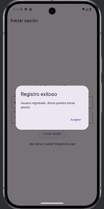
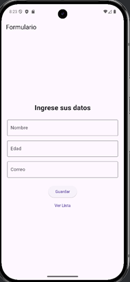
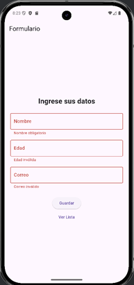
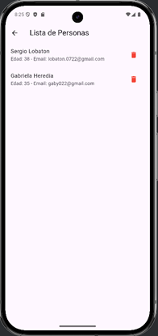

# Mini-App Flutter: Formulario Validado + Firebase Auth

## Descripción del proyecto

Este proyecto es una mini-aplicación Flutter desarrollada como parte del **módulo de Desarrollo de Aplicaciones Móviles**.
El de proyecto tiene como objetivo combinar el uso de formularios y sus respectivas validaciones, manejar la autenticación de usuarios mediante **Firebase Authentication**.

---

## Capturas de pantalla

### Login / Registro





### Formulario




### Lista


---

##  Breve explicación del uso del formulario y autenticación

### Autenticación con Firebase

La aplicación permite al usuario autenticarse mediante **correo electrónico y contraseña** utilizando Firebase Authentication.  
En la pantalla inicial, el usuario puede:
- **Iniciar sesión** si ya tiene una cuenta.
- **Registrarse** si es un nuevo usuario.

El formulario alterna entre **Login** y **Registro** de dinámica.  
Se muestra un `AlertDialog` confirmando que el usuario se registró con exito.  
Después del login, el usuario es redirigido a la pantalla de formulario y ve un **mensaje de bienvenida** con su correo.

---

### Formulario de datos personales

Una vez autenticado, el usuario accede a un formulario que solicita:
- **Nombre** (obligatorio)
- **Edad** (número mayor que 0)
- **Correo electrónico** (en formato válido)

Al enviar el formulario:
- Se validan los campos.
- Si son correctos, se muestran en un `AlertDialog` de confirmación.
- Los campos se limpian automáticamente.
- Los datos se almacenan en una lista en memoria.

Además, el usuario puede acceder a una pantalla donde se muestra la **lista de personas ingresadas**, con la posibilidad de **eliminar entradas**.

---

## Tecnologías utilizadas

- Flutter + Dart
- Firebase Authentication
- Widgets: `TextFormField`, `AlertDialog`, `ListView`, `Form`
- Manejo de estado con `setState()`

---

## Estructura del proyecto

```bash
lib/
├── main.dart
├── screens/
│   ├── auth_screen.dart       # Pantalla de login/registro
│   ├── form_screen.dart       # Formulario de registro de personas
│   └── list_screen.dart       # Lista de personas
